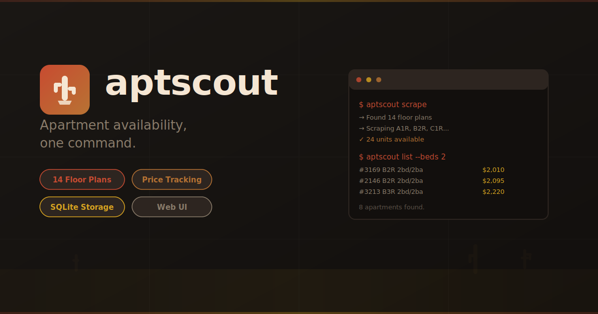
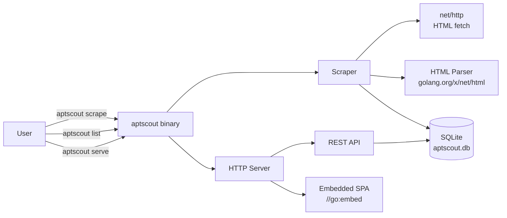
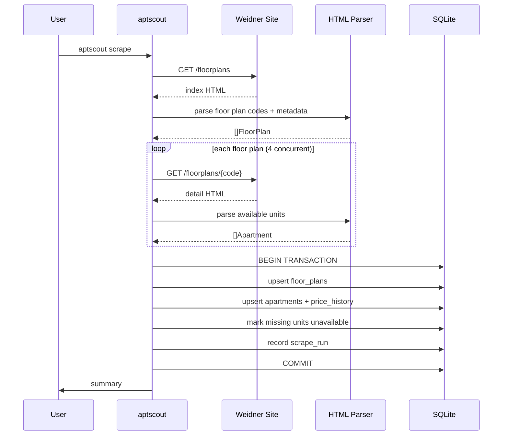

# aptscout — Apartment Availability Tracker CLI



[](https://github.com/dotbrains/aptscout/actions/workflows/ci.yml)
[](https://github.com/dotbrains/aptscout/actions/workflows/release.yml)
[](https://opensource.org/licenses/MIT)


A lightweight CLI that scrapes apartment availability from Desert Club Apartments (Weidner), stores results in SQLite, and serves a filterable web UI. Scrape once, browse anytime. Re-scraping updates the database and tracks price history over time.

## Problem

Apartment hunting on property management websites is tedious:

- Weidner's site requires clicking through 14 individual floor plan pages to see all available units.
- There's no way to filter across all floor plans simultaneously (e.g. "show me everything under $2,000").
- Availability changes daily — no way to track what appeared or disappeared without manually checking.
- Price changes are invisible — a unit listed at $2,095 yesterday might be $2,010 today.

`aptscout` scrapes all floor plans in one pass, stores everything in a local SQLite database, and serves a web UI that lets you filter, sort, and track changes across all configurations at once.

## Target Site

**Desert Club Apartments** — managed by Weidner Property Management.

- Address: 6901 E Chauncey Lane, Phoenix, AZ 85054
- Base URL: `https://arizona.weidner.com/apartments/az/phoenix/desert-club0`
- Floor plans index: `/floorplans`
- Individual floor plan: `/floorplans/{code}` (e.g. `/floorplans/b2r`)

### Floor Plan Codes

14 floor plans across 1-, 2-, and 3-bedroom configurations:

**1 Bedroom / 1 Bath:**
- `A1R` — 715 sq ft (Renovated)
- `A1P` — 715 sq ft (Premium)
- `A2R` — 810 sq ft (Renovated)
- `A2P` — 810 sq ft (Premium)
- `S1R` — 824 sq ft (Renovated)
- `S1P` — 824 sq ft (Premium)

**2 Bedroom / 2 Bath:**
- `B1R` — 1,090 sq ft (Renovated)
- `B1P` — 1,090 sq ft (Premium)
- `B2R` — 1,142 sq ft (Renovated)
- `B2P` — 1,142 sq ft (Premium)
- `B3R` — 1,153 sq ft (Renovated)
- `B3P` — 1,153 sq ft (Premium)

**3 Bedroom / 2 Bath:**
- `C1R` — 1,327 sq ft (Renovated)
- `C1P` — 1,327 sq ft (Premium)

The naming convention: letter = bedroom count (`A`=1, `B`=2, `C`=3), number = layout variant, suffix = finish level (`R`=Renovated, `P`=Premium).

### Page Structure

**Floor plans index** (`/floorplans`) lists all plans with: name, beds, baths, sqft, starting price, deposit. Some plans show "Call for details" instead of a price — these have no currently available units.

**Individual floor plan page** (`/floorplans/{code}`) lists each available unit with:
- Unit number (e.g. `# 2146`)
- Availability date (`Available Now` or `Date Available: M/D/YYYY`)
- Starting price (`Starting at: $X,XXX`)
- Amenities (freeform text, e.g. `Garage Unattached, 2nd Floor`)

Data is rendered in static HTML — no JavaScript hydration required. Standard HTTP GET + HTML parsing is sufficient.

## Commands

### `aptscout scrape`

Scrape all floor plans and update the database.

1. Fetches the floor plans index page to discover all plan codes and metadata.
2. Fetches each individual floor plan page concurrently (bounded at 4 concurrent requests to be respectful).
3. Parses available units from the HTML.
4. Upserts floor plan metadata into the `floor_plans` table.
5. For each unit:
   - If it already exists in the database, updates price and availability. If the price changed, inserts a `price_history` record.
   - If it's new, inserts into `apartments` and records the initial price in `price_history`.
6. Marks units that were previously available but no longer appear as `is_available = false`.
7. Records the scrape run in `scrape_runs`.
8. Prints a summary to stdout.

```
$ aptscout scrape

[1/2] Desert Club Apartments
  Fetching floor plans and units... ⠋ (3s)
  ✓ 14 plans, 24 units (24 new)

[2/2] Hideaway North Scottsdale
  Fetching floor plans and units... ⠹ (5s)
  ✓ 17 plans, 10 units (10 new)

✓ Scrape complete.
→ 34 units available (34 new)
→ Database: ~/.local/share/aptscout/aptscout.db
```

A braille-dot spinner with elapsed time animates while each provider is being scraped. Per-provider results show plan/unit counts inline.

### `aptscout list`

List all currently available apartments from the database.

- `--beds <n>` — Filter by bedroom count.
- `--baths <n>` — Filter by bathroom count.
- `--max-price <n>` — Maximum monthly rent.
- `--min-price <n>` — Minimum monthly rent.
- `--plan <code>` — Filter by floor plan code (e.g. `B2R`).
- `--renovated` — Only show renovated (`R`) units.
- `--available-by <date>` — Only units available by this date (YYYY-MM-DD).
- `--sort <field>` — Sort by `price`, `date`, `sqft`, `unit` (default: `price`).
- `--json` — Output as JSON instead of a table.

```
$ aptscout list --beds 2 --max-price 2100
UNIT    PLAN   BEDS  BATHS  SQFT   PRICE    AVAILABLE     FLOOR  AMENITIES
#2146   B2R    2     2      1,142  $2,095   Now           2nd    Garage Unattached
#3169   B2R    2     2      1,142  $2,010   2026-04-17    3rd    —
#2051   B2R    2     2      1,142  $2,095   2026-06-03    2nd    Garage Unattached
#1042   B1R    2     2      1,090  $2,010   2026-04-01    1st    —

4 apartments found.
```

```
$ aptscout list --json
[
  {
    "unit_number": "2146",
    "floor_plan": "B2R",
    "bedrooms": 2,
    "bathrooms": 2,
    "sqft": 1142,
    "price": 2095,
    "available_date": null,
    "available_now": true,
    "floor": 2,
    "amenities": ["Garage Unattached"],
    "is_renovated": true,
    "deposit": 700,
    "first_seen": "2026-03-22T18:00:00Z",
    "last_seen": "2026-03-22T18:00:00Z"
  },
  ...
]
```

### `aptscout history <unit_number>`

Show price history for a specific unit.

```
$ aptscout history 2146
UNIT #2146 — B2R (2 bed / 2 bath, 1,142 sq ft)

DATE                 PRICE     CHANGE
2026-03-15 10:00     $2,195    —
2026-03-18 10:00     $2,095    -$100
2026-03-22 18:00     $2,095    (no change)
```

### `aptscout stats`

Show summary statistics from the database.

```
$ aptscout stats
Desert Club Apartments — 6901 E Chauncey Lane, Phoenix, AZ 85054

Floor Plans:    14
Available Now:  12 units

By Bedrooms:
  1 bed:  4 units ($1,635 – $1,910)
  2 bed:  6 units ($2,010 – $2,215)
  3 bed:  2 units ($2,285 – $2,535)

Last Scrape:    2026-03-22 18:00:00 (2 minutes ago)
Total Scrapes:  15
```

### `aptscout serve`

Start a local web UI to browse apartments.

- `--port <n>` — Port to serve on (default: `8700`). If the port is in use, automatically falls back to an OS-assigned free port.
- `--open` — Automatically open the browser.

All HTML/CSS/JS is embedded in the Go binary via `//go:embed` — no external dependencies, no Node.js, no build step.

**API endpoints** (served under `/api/`):
- `GET /api/apartments` — List available apartments. Query params: `property`, `beds`, `baths`, `min_price`, `max_price`, `plan`, `renovated`, `available_by`, `sort`, `order`.
- `GET /api/apartments/{property}/{unit}` — Full details for a specific unit including price history.
- `GET /api/floor-plans` — List floor plans. Query param: `property`.
- `GET /api/stats` — Summary statistics. Query param: `property`.
- `GET /api/scrape-runs` — List past scrape runs.
- `POST /api/scrape` — Trigger a scrape of all properties from the UI.

**Frontend** is a vanilla JS SPA with hash-based routing:
- `#/` — Property picker: shows each property with live unit/plan counts.
- `#/property/{id}` — Dashboard: apartment card grid with filter sidebar for the selected property.
- `#/unit/{property}/{unit}` — Unit detail: price history chart, amenities, floor plan info.
- `#/floor-plans` — Floor plan overview with availability counts per plan.

**Property picker (home page):**
- Card for each registered property showing name, location, available units, floor plan count.
- Click a card to navigate to that property's apartment dashboard.
- Total stats across all properties shown at the bottom.

**Dashboard features:**
- **Filter sidebar** — Persistent filter panel with: bedroom count (1/2/3 toggle buttons), bathroom count, price range inputs, date range picker (from/to), floor plan multi-select, renovated/premium toggle.
- **Date range filter** — Two date inputs to find units available in a specific window. Units marked "Available Now" always show. Contextual empty state with `calendar-x` icon and helpful message when no units match.
- **Apartment cards** — Each card shows: unit number, floor plan code, property badge, bed/bath, sqft, price, availability date, floor level, amenities. Lucide icons throughout.
- **Sort controls** — Sort by price (low→high, high→low), availability date (Available Now first, then by date, TBD last), sqft, unit number.
- **Scrape button** — Trigger a re-scrape from the UI. Shows a full-page loading overlay with spinner and status text, then refreshes with a toast.
- **Last scraped** — Relative timestamp in the header.
- **Back link** — "← All Properties" returns to the property picker.

**Unit detail features:**
- Price history timeline (simple SVG line chart, no external charting library).
- All metadata: property, floor plan, beds, baths, sqft, deposit, floor, amenities.
- First seen / last seen timestamps.
- Direct link to the floor plan page on the property's site.

**⌘K command palette:**
- Opens with `⌘K` / `Ctrl+K` or the ⌘K button in the navbar.
- Commands: navigate to properties, browse specific properties, view floor plans, re-scrape, clear filters.
- Fuzzy search, arrow key navigation, Enter to execute, Escape to close.

**Keyboard shortcuts:**
- `⌘K` / `Ctrl+K` — Open command palette.
- `/` — Focus the search/filter.
- `r` — Trigger re-scrape.
- `Escape` — Clear filters.

```
$ aptscout serve
→ Serving at http://localhost:8700
→ Database: ~/.local/share/aptscout/aptscout.db
→ Press Ctrl+C to stop

$ aptscout serve --port 9000 --open
→ Serving at http://localhost:9000
→ Opening browser...

# If port 8700 is already in use:
$ aptscout serve
→ Port 8700 in use, finding a free port...
→ Serving at http://localhost:52413
→ Database: ~/.local/share/aptscout/aptscout.db
→ Press Ctrl+C to stop
```

### `aptscout clean`

Remove stale data from the database.

- `--days <n>` — Remove apartments not seen in N days (default: 30).
- `--dry-run` — Show what would be removed without deleting.

```
$ aptscout clean --days 14
→ Removing 5 apartments not seen in 14 days...
✓ Cleaned 5 stale records.
```

### Global Flags

| Flag | Description |
|---|---|
| `--db <path>` | Override database path (default: `~/.local/share/aptscout/aptscout.db`) |
| `--version` | Print the version and exit |
| `--help` | Show help for any command |

## Database Schema

SQLite database stored at `~/.local/share/aptscout/aptscout.db`. Created automatically on first run.

### `floor_plans`

```sql
CREATE TABLE floor_plans (
    property     TEXT NOT NULL,
    code         TEXT NOT NULL,
    bedrooms     INTEGER NOT NULL,
    bathrooms    INTEGER NOT NULL,
    sqft         INTEGER NOT NULL,
    deposit      INTEGER,
    is_renovated BOOLEAN NOT NULL,
    features     TEXT,
    updated_at   TIMESTAMP NOT NULL DEFAULT CURRENT_TIMESTAMP,
    PRIMARY KEY (property, code)
);
```

### `apartments`

```sql
CREATE TABLE apartments (
    property       TEXT NOT NULL,
    unit_number    TEXT NOT NULL,
    floor_plan     TEXT NOT NULL,
    price          INTEGER,
    available_date TEXT,
    available_now  BOOLEAN NOT NULL DEFAULT 0,
    floor          INTEGER,
    amenities      TEXT,
    is_available   BOOLEAN NOT NULL DEFAULT 1,
    first_seen     TIMESTAMP NOT NULL DEFAULT CURRENT_TIMESTAMP,
    last_seen      TIMESTAMP NOT NULL DEFAULT CURRENT_TIMESTAMP,
    PRIMARY KEY (property, unit_number)
);
```

### `price_history`

```sql
CREATE TABLE price_history (
    id          INTEGER PRIMARY KEY AUTOINCREMENT,
    property    TEXT NOT NULL,
    unit_number TEXT NOT NULL,
    price       INTEGER NOT NULL,
    scraped_at  TIMESTAMP NOT NULL DEFAULT CURRENT_TIMESTAMP
);

CREATE INDEX idx_price_history_prop_unit ON price_history(property, unit_number);
CREATE INDEX idx_price_history_date ON price_history(scraped_at);
```

### `scrape_runs`

```sql
CREATE TABLE scrape_runs (
    id              INTEGER PRIMARY KEY AUTOINCREMENT,
    started_at      TIMESTAMP NOT NULL,
    completed_at    TIMESTAMP,
    floor_plans     INTEGER NOT NULL DEFAULT 0,   -- plans scraped
    units_found     INTEGER NOT NULL DEFAULT 0,   -- total units found
    units_new       INTEGER NOT NULL DEFAULT 0,   -- new units
    units_removed   INTEGER NOT NULL DEFAULT 0,   -- units no longer available
    units_changed   INTEGER NOT NULL DEFAULT 0,   -- units with price changes
    error           TEXT                           -- NULL on success
);
```

## Scraping Strategy

### HTML Parsing

The Weidner site renders apartment data in static HTML. Each unit on a floor plan page follows this pattern:

```
### Apartment: # {unit_number}

{Available Now | Date Available: M/D/YYYY}

Starting at: ${price}

Apply Now

- Amenities

{amenity text, e.g. "Garage Unattached, 2nd Floor"}
```

Parsing approach:
1. Find all `h3` elements containing `Apartment: #`.
2. Extract unit number from the heading text.
3. Walk siblings to find availability text, price, and amenities.
4. Parse floor number from amenity text using regex (e.g. `(\d+)(st|nd|rd|th) Floor`).

### Floor Plan Discovery

Rather than hardcoding the 14 floor plan codes, `aptscout` discovers them dynamically from the index page:
1. Fetch `/floorplans`.
2. Parse all `h2` elements that match known patterns (letter + number + R/P suffix).
3. Extract metadata (beds, baths, sqft, price, deposit) from each card.
4. Build the list of URLs to scrape.

This makes the tool resilient to Desert Club adding or removing floor plans.

### Rate Limiting

- Maximum 2 concurrent HTTP requests per provider.
- 1s minimum delay between requests to the same host.
- Browser-realistic `User-Agent` and `Sec-Fetch-*` headers to avoid bot detection.
- HTTP cookie jar persists cookies across requests (required by some anti-bot systems).
- Retry on 429 (rate limited) with exponential backoff (1s, 2s, 4s, max 3 retries).
- Retry on 403 (forbidden) with longer backoff; bail after 2 consecutive 403s since the site is actively blocking.

### Update Logic

On each scrape:
1. Fetch all floor plans and their units.
2. For each unit found:
   - If `unit_number` exists in DB and `is_available = true`: update `price`, `available_date`, `last_seen`. If `price` changed, insert into `price_history`.
   - If `unit_number` exists but `is_available = false`: set `is_available = true`, update fields, insert price history.
   - If `unit_number` is new: insert into `apartments` and `price_history`.
3. For units in DB with `is_available = true` that were NOT found in this scrape: set `is_available = false`, update `last_seen`.
4. Record the scrape run summary in `scrape_runs`.

All mutations happen in a single SQLite transaction per scrape.

## Architecture



### Scrape Pipeline



## Package Structure

```
aptscout/
├── main.go                          # Entry point, version injection
├── cmd/                             # Cobra commands
│   ├── root.go                      # Root command, global flags
│   ├── scrape.go                    # `aptscout scrape` — run the scraper
│   ├── list.go                      # `aptscout list` — query + display apartments
│   ├── history.go                   # `aptscout history` — unit price history
│   ├── stats.go                     # `aptscout stats` — summary statistics
│   ├── serve.go                     # `aptscout serve` — web UI server
│   └── clean.go                     # `aptscout clean` — remove stale data
├── internal/
│   ├── scraper/                     # Web scraping logic
│   │   ├── scraper.go               # Orchestrator: fetch index → fan out → collect results
│   │   ├── scraper_test.go          # Scraper tests (mock HTTP)
│   │   ├── parser.go                # HTML → structs (floor plans, apartments)
│   │   └── parser_test.go           # Parser tests (fixture HTML files)
│   ├── spinner/                     # Terminal spinner with elapsed time
│   │   ├── spinner.go               # Animated braille spinner with duration display
│   │   └── spinner_test.go          # Spinner tests
│   ├── db/                          # Database layer
│   │   ├── db.go                    # Open/migrate, transaction helpers
│   │   ├── db_test.go               # Schema + migration tests
│   │   ├── migrations.go            # Schema creation + future migrations
│   │   ├── floor_plans.go           # FloorPlan CRUD
│   │   ├── apartments.go            # Apartment CRUD, availability toggling
│   │   ├── apartments_test.go       # Apartment query tests
│   │   ├── price_history.go         # Price history insert + query
│   │   ├── price_history_test.go    # Price history tests
│   │   ├── scrape_runs.go           # Scrape run recording
│   │   └── scrape_runs_test.go      # Scrape run tests
│   ├── models/                      # Domain types
│   │   └── models.go                # FloorPlan, Apartment, PriceRecord, ScrapeRun
│   ├── server/                      # Web UI server (aptscout serve)
│   │   ├── server.go                # HTTP handler setup, API routes, static serving
│   │   ├── server_test.go           # API handler tests (httptest)
│   │   └── static/                  # Embedded frontend assets (//go:embed)
│   │       ├── index.html           # HTML shell
│   │       ├── style.css            # Dark theme, responsive
│   │       ├── app.js               # Vanilla JS SPA (router, filters, cards, chart)
│   │       └── favicon.svg          # App favicon
│   └── display/                     # CLI output formatting
│       ├── table.go                 # Table renderer for list/history/stats
│       └── json.go                  # JSON output formatter
├── testdata/                        # HTML fixtures for parser tests
│   ├── floorplans_index.html        # Sample index page
│   ├── floorplan_b2r.html           # Sample B2R detail page
│   └── floorplan_empty.html         # Floor plan with no availability
├── .github/workflows/
│   ├── ci.yml                       # CI: test, lint, build
│   └── release.yml                  # Release via GoReleaser
├── .goreleaser.yaml                 # Cross-compilation config
├── Makefile                         # build, test, lint, install targets
├── go.mod
├── go.sum
├── SPEC.md                          # This file
├── README.md                        # User-facing documentation
└── LICENSE
```

## Domain Types

```go
type FloorPlan struct {
    Code        string   `json:"code"`         // e.g. "B2R"
    Bedrooms    int      `json:"bedrooms"`
    Bathrooms   int      `json:"bathrooms"`
    SqFt        int      `json:"sqft"`
    Deposit     int      `json:"deposit"`
    IsRenovated bool     `json:"is_renovated"`
    Features    []string `json:"features"`
    UpdatedAt   time.Time `json:"updated_at"`
}

type Apartment struct {
    UnitNumber    string    `json:"unit_number"`
    FloorPlan     string    `json:"floor_plan"`
    Bedrooms      int       `json:"bedrooms"`      // denormalized from floor plan
    Bathrooms     int       `json:"bathrooms"`      // denormalized from floor plan
    SqFt          int       `json:"sqft"`           // denormalized from floor plan
    Price         int       `json:"price"`
    AvailableDate *string   `json:"available_date"` // nil = available now
    AvailableNow  bool      `json:"available_now"`
    Floor         int       `json:"floor"`
    Amenities     []string  `json:"amenities"`
    IsRenovated   bool      `json:"is_renovated"`   // denormalized
    Deposit       int       `json:"deposit"`         // denormalized
    IsAvailable   bool      `json:"is_available"`
    FirstSeen     time.Time `json:"first_seen"`
    LastSeen      time.Time `json:"last_seen"`
}

type PriceRecord struct {
    ID         int       `json:"id"`
    UnitNumber string    `json:"unit_number"`
    Price      int       `json:"price"`
    ScrapedAt  time.Time `json:"scraped_at"`
}

type ScrapeRun struct {
    ID           int        `json:"id"`
    StartedAt    time.Time  `json:"started_at"`
    CompletedAt  *time.Time `json:"completed_at"`
    FloorPlans   int        `json:"floor_plans"`
    UnitsFound   int        `json:"units_found"`
    UnitsNew     int        `json:"units_new"`
    UnitsRemoved int        `json:"units_removed"`
    UnitsChanged int        `json:"units_changed"`
    Error        *string    `json:"error"`
}

type ApartmentFilter struct {
    Beds        *int     `json:"beds"`
    Baths       *int     `json:"baths"`
    MinPrice    *int     `json:"min_price"`
    MaxPrice    *int     `json:"max_price"`
    Plan        *string  `json:"plan"`
    Renovated   *bool    `json:"renovated"`
    AvailableBy *string  `json:"available_by"`
    Sort        string   `json:"sort"`  // price, date, sqft, unit
    Order       string   `json:"order"` // asc, desc
}
```

## Web UI Design

### Color Scheme

Dark theme with teal/emerald accents (apartment/real-estate feel):
- Background: `#0f1419` (near-black)
- Card background: `#1a2332` (dark slate-blue)
- Primary accent: `#10b981` (emerald green)
- Secondary accent: `#06b6d4` (cyan)
- Text: `#e2e8f0` (light gray)
- Muted text: `#94a3b8` (slate)
- Price highlight: `#fbbf24` (amber/gold)
- Available now badge: `#10b981` (green)
- Future date badge: `#3b82f6` (blue)

### Card Layout

Each apartment card:
```
┌──────────────────────────────────┐
│ #2146                    B2R     │
│ 2 bed · 2 bath · 1,142 sqft     │
│                                  │
│ $2,095/mo          Available Now │
│                                  │
│ 2nd Floor · Garage Unattached    │
│ Deposit: $700                    │
└──────────────────────────────────┘
```

### Filter Sidebar

```
┌─ Filters ──────────────────┐
│                            │
│ Bedrooms    [1] [2] [3]   │
│ Bathrooms   [1] [2]       │
│                            │
│ Price                      │
│ $1,600 ──●────── $2,600   │
│                            │
│ Floor Plan                 │
│ ☑ A1R  ☑ A2R  ☑ B1R ...  │
│                            │
│ Type                       │
│ ○ All  ○ Renovated  ○ Prem│
│                            │
│ Available By               │
│ [____________]             │
│                            │
│ [Clear Filters]            │
└────────────────────────────┘
```

## Dependencies

- **Go 1.22+** — Implementation language.
- **`github.com/spf13/cobra`** — Command/subcommand routing.
- **`golang.org/x/net/html`** — HTML tokenizer and parser.
- **`modernc.org/sqlite`** — Pure-Go SQLite driver (no CGO required, cross-compiles cleanly).
- **`net/http`** — HTTP client for scraping, HTTP server for web UI.
- **Standard library `testing`** — Unit tests with table-driven patterns.

No external JavaScript frameworks. No Node.js. No Playwright (site is static HTML).

## Testing Strategy

Target: **≥ 80% code coverage**. Tests must not require network access.

### Unit Tests

| Area | What to test | Approach |
|---|---|---|
| **HTML parser** | Floor plan index parsing, unit detail parsing, edge cases (no units, malformed HTML, "Call for details") | HTML fixture files in `testdata/` |
| **Scraper orchestration** | Concurrent fetching, error handling, rate limiting | Mock HTTP server (`httptest`) |
| **DB operations** | CRUD for all tables, filter queries, price history tracking, availability toggling, transaction atomicity | In-memory SQLite (`:memory:`) |
| **API handlers** | All endpoints, query param filtering, error responses, JSON structure | `httptest` + in-memory DB |
| **Display formatting** | Table output, JSON output, edge cases (empty results, long values) | String assertion |

### What is NOT tested

- Live scraping against the real Weidner website (network-dependent, fragile).
- Visual review of the web UI (manual QA).
- Browser rendering of the SPA.

## GitHub Actions

### CI — `.github/workflows/ci.yml`

Triggered on push to `main` and all pull requests.

**Jobs:**

1. **test**
   - Matrix: `go: [stable]`, `os: [ubuntu-latest, macos-latest]`
   - Steps: checkout → setup Go → `go vet ./...` → `go test -race -coverprofile=coverage.out ./...` → enforce ≥ 80% coverage

2. **lint**
   - Uses `golangci/golangci-lint-action@v8`

3. **build**
   - `go build -o aptscout .` on both macOS and Linux

### Release — `.github/workflows/release.yml`

Triggered on tags matching `v*`.

Uses GoReleaser. Archives: `aptscout_darwin_arm64`, `aptscout_darwin_amd64`, `aptscout_linux_arm64`, `aptscout_linux_amd64`.

## Installation

### Via `go install`

```sh
go install github.com/dotbrains/aptscout@latest
```

### Via Homebrew

```sh
brew tap dotbrains/tap
brew install --cask aptscout
```

### From source

```sh
git clone https://github.com/dotbrains/aptscout.git
cd aptscout
make install
```

## Example Workflows

### Daily apartment check

```
$ aptscout scrape
→ Fetching floor plans index...
→ Found 14 floor plans
→ Scraping A1R, A1P, A2R, A2P, S1R, S1P, B1R, B1P, B2R, B2P, B3R, B3P, C1R, C1P...

✓ Scrape complete.
→ 12 units available (3 new, 1 price changed, 2 no longer available)

$ aptscout list --beds 2 --max-price 2100 --sort price
UNIT    PLAN   BEDS  BATHS  SQFT   PRICE    AVAILABLE     FLOOR  AMENITIES
#3169   B2R    2     2      1,142  $2,010   2026-04-17    3rd    —
#1042   B1R    2     2      1,090  $2,010   2026-04-01    1st    —
#2146   B2R    2     2      1,142  $2,095   Now           2nd    Garage Unattached
#2051   B2R    2     2      1,142  $2,095   2026-06-03    2nd    Garage Unattached

4 apartments found.
```

### Track a price drop

```
$ aptscout history 3169
UNIT #3169 — B2R (2 bed / 2 bath, 1,142 sq ft)

DATE                 PRICE     CHANGE
2026-03-10 10:00     $2,095    —
2026-03-15 10:00     $2,050    -$45
2026-03-22 18:00     $2,010    -$40
```

### Browse in the web UI

```
$ aptscout serve --open
→ Serving at http://localhost:8700
→ Opening browser...
```

### Export for comparison

```
$ aptscout list --json > apartments.json
```

## Design Decisions

### 1. Static HTML scraping, not browser automation

The Weidner site renders apartment data server-side. Using `net/http` + `golang.org/x/net/html` is faster, lighter, and more reliable than spinning up a headless browser. If the site ever moves to client-side rendering, this can be swapped for a Playwright-based approach.

### 2. SQLite over flat files

SQLite enables filtering, sorting, price history tracking, and atomic updates — all of which would require significant custom code with flat JSON files. The `modernc.org/sqlite` driver is pure Go (no CGO), so the binary still cross-compiles cleanly.

### 3. Dynamic floor plan discovery

Rather than hardcoding the 14 floor plan codes, `aptscout` discovers them from the index page. This means if Desert Club adds a new floor plan (e.g. `D1R` for a 4-bed), it'll be picked up automatically.

### 4. Price history tracking

The primary value-add over just refreshing the Weidner website is historical tracking. Knowing that unit #3169 dropped from $2,095 to $2,010 over two weeks is actionable information for negotiation or timing.

### 5. Embedded web UI (same pattern as prr)

All HTML/CSS/JS is embedded via `//go:embed`. Single binary, no runtime dependencies, no build step. The serve command is additive — the CLI works perfectly fine without it.

### 6. Respectful scraping

Bounded concurrency (4), delays between requests (500ms), proper User-Agent, retry with backoff. This is a single apartment complex with 14 pages — not a large-scale crawl.

## Non-Goals

- **Multi-property support.** This is purpose-built for Desert Club. Supporting arbitrary Weidner properties or other management companies is out of scope (though the architecture doesn't prevent it).
- **Notifications/alerts.** No email, SMS, or push notifications for new apartments or price drops. Use `cron` + `aptscout scrape` and check the UI.
- **Automated applications.** `aptscout` is read-only. It does not fill out forms or submit applications.
- **Mobile app.** The web UI is responsive but this is a CLI-first tool.
